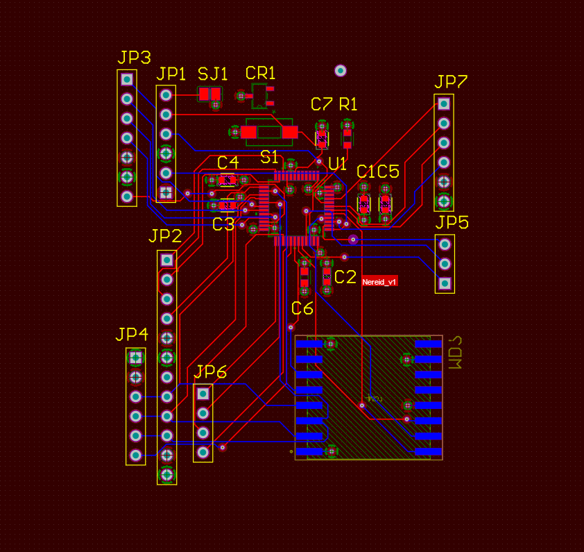

# AEGIS: Autonomous Irrigation Controller for Frost Damage Prevention

This project implements an autonomous irrigation controller designed to prevent frost damage on citrus trees using undertree microsprinklers. 
The system monitors environmental conditions and activates the irrigation system when frost risk is detected.

*See also: <https://github.com/labros-zotos/meta-aegis> a custom **Yocto Project Layer for AEGIS***

## Hardware Components

- Raspberry Pi 3/4 Model B
- ~~BME280 Sensor (Temperature, Humidity, Pressure)~~
- SHT40 Sensor (Temperature, Humidity)
- 5V Power Supply
- Solid State Relay


*Figure 1: This image shows how all the hardware components are installed onsite and connected outside the building that houses the well pump.*

## Features

- Real-time monitoring of temperature and humidity
- Automated activation of irrigation system based on temperature drop and frost risk
- Data logging for analysis 

## Build and Installation of AEGIS service

Step-by-step instructions for building and installing the autonomous irrigation controller on Raspberry Pi 4 running Raspberry Pi OS (64-bit) Bookworm.

### Hardware Connections

1. SHT40 Sensor:
   - VCC to Pin 1 (3.3V)
   - GND to Pin 6 (Ground)
   - SDA to Pin 3 (GPIO 2, SDA)
   - SCL to Pin 5 (GPIO 3, SCL)

3. Solid State Relay (for pump control):
   - Control pin to GPIO 17 (Pin 11)
   - GND to Pin 14 (Ground)

### Raspberry Pi Configuration

1. Use Imager to flash the Raspberry Pi OS Bookworm onto an SD card. 
    
    In the advanced options Enable SSH and Configure wireless LAN **or** use the files provided under the raspberry_config folder.
2. Boot the Raspberry Pi after making sure all the hardware is connected and connect to it via SSH.
3. Enable I2C interface: 

    1. Run the following command:
        ```
        sudo raspi-config
        ```
    3. Navigate to the "Interfacing Options" option in the menu and press Enter.
    4. In the "Interfacing Options" menu, scroll down and select "I2C" and press Enter.
    5. When asked select "Yes" and press Enter.
    6. Select "Finish" button and press Enter to exit the configuration tool.

### Build

1. Install git and clone the AEGIS repository:

```
git clone --recursive https://github.com/labros-zotos/aegis.git
```

2. Install dependencies
```
sudo apt update
sudo apt install pigpio pigpiod libspdlog-dev libfmt-dev
```

3. Build the aegis source code using the provided Makefile:
```
cd aegis/src && make -j2
```

### Install Service (systemd)

1. Copy executable to /usr/sbin
```
sudo cp aegis /usr/sbin/aegis
```

2. Change permissions
```
sudo chown root:root /usr/sbin/aegis
sudo chmod 755 /usr/sbin/aegis
```

3. Copy the provided service file to the systemd directory:
```
sudo cp ../service/aegis.service /etc/systemd/system/aegis.service
```
4. Enable and start the service:
```
sudo systemctl daemon-reload
sudo systemctl enable aegis.service && sudo systemctl start aegis.service 
```
5. Check the status of the service:
```
sudo systemctl status aegis.service 
```

*Note: Debug level logs are enabled by default.(Configurable in https://github.com/labros-zotos/aegis/blob/main/src/aegis.cpp#L14)*
## Results

AEGIS was proven highly effective in protecting the lemon trees from frost damage both during the 2022 and 2023 winter frost events in our area, the system successfully prevented significant damage to the orchard.

### 2022 Winter Frost
In the winter of 2022, we experienced several nights where temperatures dropped below freezing. 
The system accurately detected these conditions and activated the microsprinklers, maintaining a protective layer of water around the trees keeping the roots of the plant from freezing as well as altering the microclimate by warming the air around the tree. As a result, we observed minimal frost damage compared to neighboring orchards without such systems even though the temperatures dropped beyond -5 degrees Celsius and the trees were just one year old.

### 2023 Winter Frost
The system's continued to protect the trees during the 2023 frost events. The health of the trees remained excellent and they experienced little to no burned leaves from the frosts. An improvement to the system was a reflective cover above the weatherproof box that housed the electronics as I noticed that the Raspberry Pi was overheating during the hottest days of summer 2022.


*Figure 2: Temperature, Humidity, and Pump State During 2022 Frost Event - This graph shows the correlation between temperature (blue line), humidity (orange line), and pump activation (green line) over a 24-hour period during a frost event in 2022. Note how the pump activates as temperatures approach freezing, helping to maintain a stable environment around the trees.*

These results demonstrate the effectiveness of AEGIS isn protecting citrus trees from frost damage, potentially saving significant crop losses and maintaining orchard health through harsh winter conditions.

## Improvments during the 2024 season
The winter of 2024 has been very mild and no frost was ever predicted for the area.
This was a great opportunity to improve both software and hardware components of the system.

### New temperature and humidity sensor - SHT40
The original BME280 sensor started to fail after two years exposed in the elements. We decided to use SHT40 as a replacement as it should be more robust and it has a useful internal heater to keep the sensor in a good state even when exposed to high humidity conditions.

### Complete rewrite of the code base
While the first iteration that used the BME280 had the AEGIS service written in Python I decided to write the new version with C++ and improve the code structure.

### Design of the Nereids - An STM32 powered wireless LoRa sensor
The measurements collected from the wired BME280 sensor proved to be fairly accurate and useful during the past two years.
However it is limited as it is impossible to place the sensor directly in the orchard or have multiple sensors in order to get a better picture of the conditions in different parts of the field.

I have begun designing a new collection of sensors that will communicate with AEGIS with the LoRa protocol. 
The new sensor is called Nereid and will have the following features:

- Use a low-power STM32 MCU
- SHT40 Sensor (Temperature, Humidity)
- DS18B20 Sensor (Soil Temperature)
- Watermark® soil moisture sensor (electrical resistance sensor)
- LoRa communication (RFM95/SX1278 chip)
- 1-2 year battery life (depending on the measurement frequency)

<p float="left">
    
     
</p>

*Figure 3: Nereid wireless sensor interface module initial circuit schematic and pcb design.*

#### Notes
The new STM32WL3 Family could be a good alternative to working with the STM32L0 + RFM95W combination as I had originally designed.  

## Dependencies

This project uses the following libraries:

- [Sensirion Raspberry Pi I2C SHT4x](https://github.com/Sensirion/raspberry-pi-i2c-sht4x): C library for the Sensirion SHT4x humidity and temperature sensor series.

Please refer to the respective library's documentation for installation and usage details.

## Acknowledgements

This project was inspired by the need to protect citrus orchards from frost damage, a common occurrence in the agriculture area around my hometown.

The frost protection strategy implemented in this project was based on information from the following publication:

Parsons, L. R., & Boman, B. J. (2023). Microsprinkler Irrigation for Cold Protection of Florida Citrus. EDIS, 2023(2). 
https://edis.ifas.ufl.edu/publication/CH182
